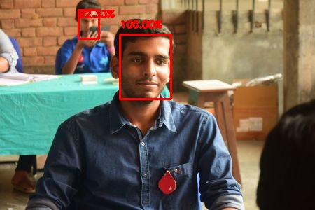
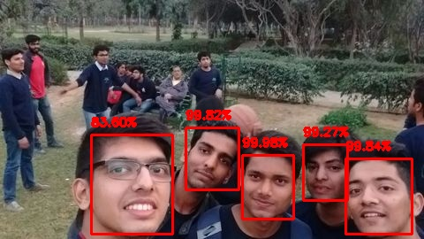
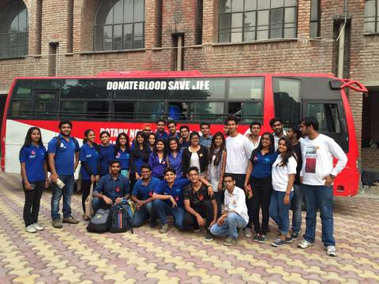

# Face Detection with OpenCV
### Uses the hidden deep learning based pre-trained face detector in OpenCV.

Performed face detection on images and videos.

All thanks to Adrian Rosebrock (from [pyimagesearch](https://www.pyimagesearch.com/)) for making
great tutorials. This project is inspired from his blog [Face detection with OpenCV and deep learning](https://www.pyimagesearch.com/2018/02/26/face-detection-with-opencv-and-deep-learning/)

## **Key Points**
1. Used deep learning based face detector instead of Haar cascades based face detection, hence it's much more accurate
2. The OpenCV deep learning face detector is based on Single Shot Detector (SSD) with a Resnet base network.
3. This is a Caffe based face detector which can be found in dnn samples in OpenCV.
4. Performed face detection on images as well as on video stream. Code files of both are included.
5. I've also put the model architecture file (deploy.prototxt.txt) and trained weights (res10_300x300_ssd_iter_140000.caffemodel)

 ## **Requirements: (with versions i tested on)**
 1. python          (3.7.1)
 2. opencv          (4.1.0)
 3. numpy           (1.61.2)
 4. imutils         (0.5.2)

 ## **Commands to run the detection:**
 For face detection in image:
 ```
 python detect_image.py --prototxt deploy.prototxt.txt \
        --model res10_300x300_ssd_iter_140000.caffemodel \
        --image assets/image1.jpg
```

For face detection in video stream:
```
python detect_video.py --prototxt deploy.prototxt.txt \
        --model res10_300x300_ssd_iter_140000.caffemodel
```

## **Results:**
The performance was really great.

**input**
___


**Output**
___



**input**
___


**output**
___



## **The issue**
Unfortunately, this detector didn't worked when i passed an image with large number of faces


**input**
___


**output**
___
